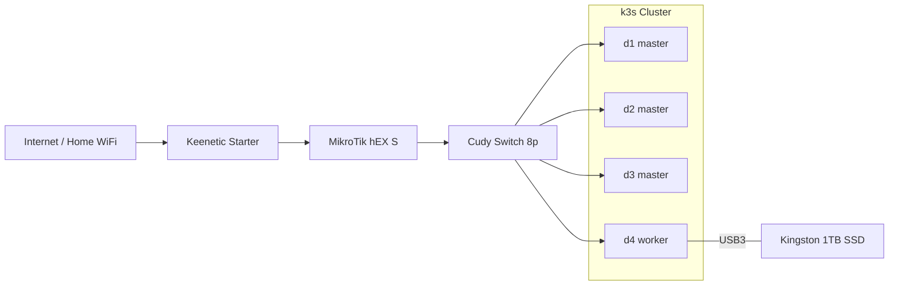

# Version 1

> November 2025 – present

The first version of the home cluster. Four mini PCs joined into a k3s cluster, with a dedicated router and internet access via a WiFi bridge.

## Goals and principles

- **Budget cluster** for learning Kubernetes and self-hosting
- **Single point of network management** – all network configuration is concentrated on MikroTik
- **Automation via Ansible** – repeatable and idempotent configuration, no manual repetition across nodes
- **No cable across the apartment** – WiFi bridge for internet access instead of running Ethernet
- **Flexibility** – workloads can run on any node, including master nodes

## Architecture

## Detailed documentation

- [Hardware](hardware.md) – specs for all devices, nodes d1-d4, storage
- [Network](network.md) – network topology, IP addressing, WiFi bridge
- [Software](software.md) – OS, k3s, Ansible, services (work in progress)
