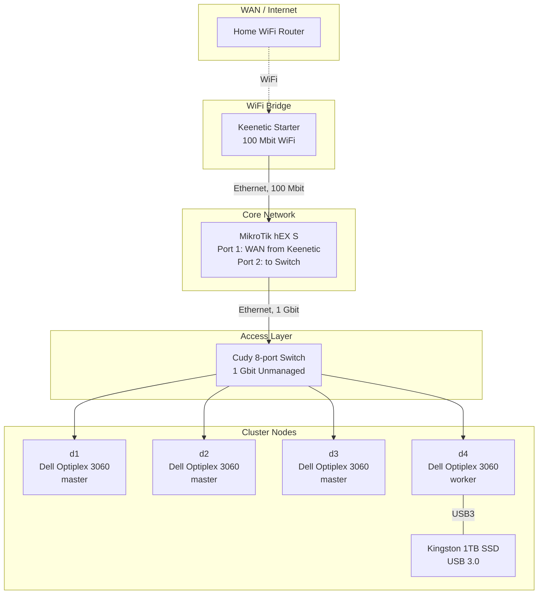

# Network

## Physical topology



## Traffic path

How a packet travels from a cluster node to the internet and back:

```
Node (d1-d4) → Cudy Switch → MikroTik hEX S → Keenetic Starter → WiFi → Home Router → ISP
```

The return path is reversed. All traffic between nodes goes through the switch at 1 Gbit. Internet traffic is limited to 100 Mbit (bottleneck: Keenetic Starter WiFi bridge).

## Role of each device

### Keenetic Starter – WiFi bridge

Its only job is to connect to the home WiFi and pass internet to MikroTik via cable. No cluster network configuration is done on it: no DHCP, no firewall, no routing. It is used exclusively as a "bridge" between WiFi and Ethernet.

### MikroTik hEX S – router

The single point of management for all cluster networking:

- **DHCP** – assigns IP addresses to nodes (or static assignments)
- **Routing** – manages traffic between the cluster and the internet
- **Firewall** – traffic filtering rules
- **DNS** (optional) – if configured

All cluster network configuration is intentionally concentrated here to have a single point of configuration.

### Cudy Switch – switch

A transparent unmanaged 8-port switch (1 Gbit). Aggregates all 4 nodes onto a single MikroTik port. Chosen for convenience and spare ports for future cluster expansion.

## Why this architecture

- **WiFi bridge instead of cable**: didn't want to run Ethernet across the entire apartment. A cheap Keenetic Starter in bridge mode solved the problem at minimal cost.
- **All logic on MikroTik**: to avoid spreading configuration across multiple devices. A single point of configuration is easier to manage and debug.
- **Unmanaged switch**: a managed one isn't needed with the current setup. All management is on MikroTik.

## Limitations

- **100 Mbit internet**: the bottleneck is the WiFi bridge (Keenetic Starter, 100 Mbit). Between nodes it's 1 Gbit.
- **No VPN**: cluster access only from the home network via cable. VPN is planned.
- **No channel redundancy**: if WiFi or Keenetic goes down, the cluster loses internet access.

<!-- ## Logical network diagram -->
<!-- TODO: add subnet descriptions, IP addresses, DHCP/static, DNS -->
