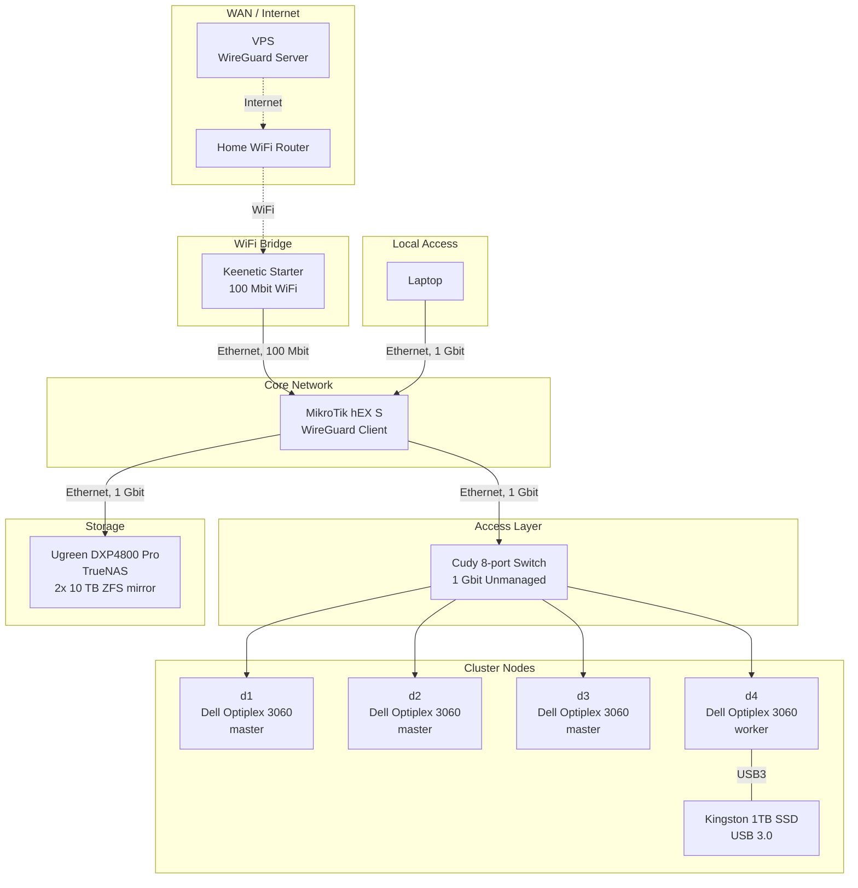
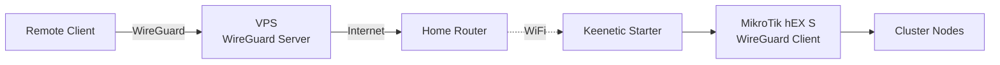

# Network

## Physical topology


```mermaid
graph TD
    subgraph wan ["WAN / Internet"]
        HomeRouter["Home WiFi Router"]
        VPS["VPS\nWireGuard Server"]
    end
    subgraph bridge ["WiFi Bridge"]
        Keenetic["Keenetic Starter\n100 Mbit WiFi"]
    end
    subgraph localAccess ["Local Access"]
        Laptop["Laptop"]
    end
    subgraph core ["Core Network"]
        MikroTik["MikroTik hEX S\nWireGuard Client"]
    end
    subgraph access ["Access Layer"]
        Switch["Cudy 8-port Switch\n1 Gbit Unmanaged"]
    end
    subgraph storage ["Storage"]
        NAS["Ugreen DXP4800 Pro\nTrueNAS\n2x 10 TB ZFS mirror"]
    end
    subgraph nodes ["Cluster Nodes"]
        D1["d1\nDell Optiplex 3060\nmaster"]
        D2["d2\nDell Optiplex 3060\nmaster"]
        D3["d3\nDell Optiplex 3060\nmaster"]
        D4["d4\nDell Optiplex 3060\nworker"]
        ExtSSD["Kingston 1TB SSD\nUSB 3.0"]
    end

    VPS -.->|Internet| HomeRouter
    HomeRouter -.->|WiFi| Keenetic
    Keenetic -->|"Ethernet, 100 Mbit"| MikroTik
    Laptop -->|"Ethernet, 1 Gbit"| MikroTik
    MikroTik -->|"Ethernet, 1 Gbit"| Switch
    MikroTik -->|"Ethernet, 1 Gbit"| NAS
    Switch --> D1
    Switch --> D2
    Switch --> D3
    Switch --> D4
    D4 ---|USB3| ExtSSD
```

## Traffic path

How a packet travels from a cluster node to the internet and back:

```
Node (d1-d4) → Cudy Switch → MikroTik hEX S → Keenetic Starter → WiFi → Home Router → ISP
```

The return path is reversed. All traffic between nodes goes through the switch at 1 Gbit. Internet traffic is limited to 100 Mbit (bottleneck: Keenetic Starter WiFi bridge).

The NAS is connected directly to a dedicated MikroTik port (not through the switch). Traffic between nodes and the NAS goes through MikroTik:

```
Node (d1-d4) → Cudy Switch → MikroTik hEX S → Ugreen NAS
```

## Role of each device

### Keenetic Starter – WiFi bridge

Its only job is to connect to the home WiFi and pass internet to MikroTik via cable. No cluster network configuration is done on it: no DHCP, no firewall, no routing. It is used exclusively as a "bridge" between WiFi and Ethernet.

### MikroTik hEX S – router

The single point of management for all cluster networking:

- **DHCP** – assigns IP addresses to nodes (or static assignments)
- **Routing** – manages traffic between the cluster and the internet
- **Firewall** – traffic filtering rules
- **DNS** (optional) – if configured
- **WireGuard client** – maintains a persistent tunnel to VPS (WireGuard server) for remote cluster access

All cluster network configuration is intentionally concentrated here to have a single point of configuration.

### Cudy Switch – switch

A transparent unmanaged 8-port switch (1 Gbit). Aggregates all 4 nodes onto a single MikroTik port. Chosen for convenience and spare ports for future cluster expansion.

### Ugreen DXP4800 Pro – NAS

Connected directly to a dedicated MikroTik port. Used exclusively as data storage – no services run on it. Accessed from the cluster and from a laptop over the network.

## Why this architecture

- **WiFi bridge instead of cable**: didn't want to run Ethernet across the entire apartment. A cheap Keenetic Starter in bridge mode solved the problem at minimal cost.
- **All logic on MikroTik**: to avoid spreading configuration across multiple devices. A single point of configuration is easier to manage and debug.
- **Unmanaged switch**: a managed one isn't needed with the current setup. All management is on MikroTik.

## Cluster access

### Local connection

A laptop connects via cable directly to a free MikroTik port. Connection speed is 1 Gbit. This is the primary way to work with the cluster: used for day-to-day management as well as transferring large amounts of data (e.g. to NAS).

### WireGuard VPN

Remote access to the cluster is implemented via WireGuard VPN through an intermediate VPS:


```mermaid
graph LR
    Client["Remote Client"] -->|WireGuard| VPS["VPS\nWireGuard Server"]
    VPS -->|Internet| HomeRouter["Home Router"]
    HomeRouter -.->|WiFi| Keenetic["Keenetic Starter"]
    Keenetic --> MikroTik["MikroTik hEX S\nWireGuard Client"]
    MikroTik --> Cluster["Cluster Nodes"]
```

There is no static IP address at home – it is dynamic and can change at any time. To solve this, an external VPS with a static IP is rented, running a WireGuard server. The setup works as follows:

1. The VPS runs a WireGuard server – it accepts connections and is where users are managed
2. MikroTik is configured as a WireGuard client and maintains a persistent tunnel to the VPS
3. A remote client connects to the VPS, and traffic is routed through the tunnel into the home network

Because MikroTik initiates the connection, a change of the home IP address does not affect cluster availability – the tunnel is re-established automatically.

VPN traffic path:

```
Remote client → VPS (WireGuard) → Internet → Home Router → WiFi → Keenetic Starter → MikroTik hEX S (WireGuard) → Cudy Switch → Node (d1-d4)
```

The VPN is used for remote cluster management. It is not suitable for transferring large amounts of data due to limited throughput – for that, the local cable connection is used.

## Limitations

- **100 Mbit internet**: the bottleneck is the WiFi bridge (Keenetic Starter, 100 Mbit). Between nodes it's 1 Gbit.
- **VPN speed**: WireGuard via VPS is suitable for management but not for bulk data transfer.
- **No channel redundancy**: if WiFi or Keenetic goes down, the cluster loses internet access.

<!-- ## Logical network diagram -->
<!-- TODO: add subnet descriptions, IP addresses, DHCP/static, DNS -->
