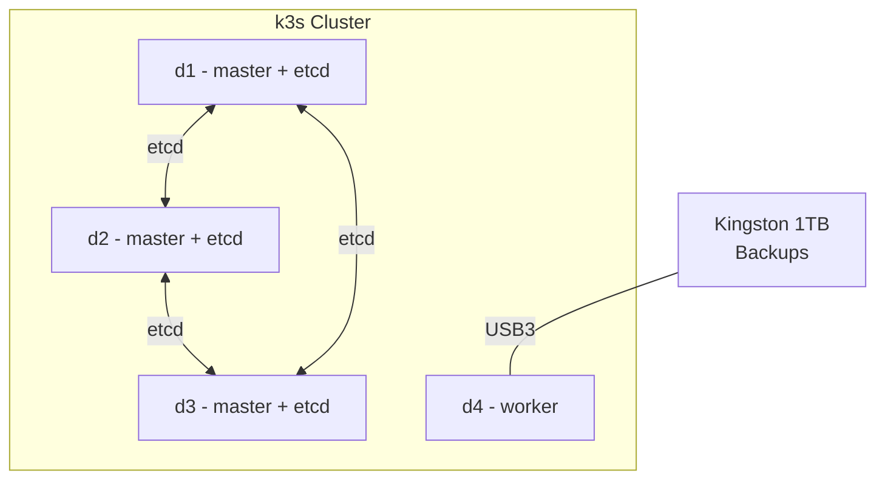

# Software

## Operating system

All nodes run **Ubuntu Server 22.04 LTS**.

## Configuration management

All node configuration is managed via **Ansible**, ensuring repeatability, idempotency, and the ability to quickly reproduce the setup when needed.

The k3s cluster was deployed using the [k3s-ansible](https://github.com/timothystewart6/k3s-ansible) playbook (by Techno Tim).

## Orchestration: k3s

A lightweight Kubernetes distribution – [k3s](https://k3s.io/).

### Cluster topology

- **3 master nodes** (d1, d2, d3) with built-in etcd for HA
- **1 worker node** (d4) with an external SSD attached for backups
- Workloads can run on **any node**, including master nodes (taints removed)

## Services and applications

| Service | Purpose |
|---------|---------|
| [CloudNativePG](https://github.com/cloudnative-pg/cloudnative-pg) | PostgreSQL cluster: one replica per node, asynchronous replication |
| [Forgejo](https://forgejo.org/) | Self-hosted Git forge for storing repositories |
| [Taiga](https://taiga.io/) | Project and task management |
| [qBittorrent](https://www.qbittorrent.org/) | Torrent client |
| [Grafana](https://grafana.com/) | Dashboards and metrics visualization |
