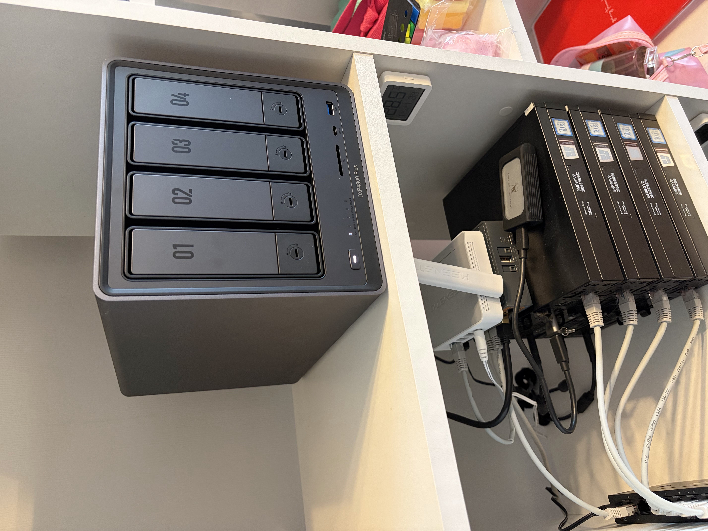

# Домашний кластер (Homelab)

Персональный домашний серверный кластер для обучения и self-hosting. Собран как бюджетная альтернатива аренде VDS, а также как площадка для практического изучения Kubernetes, сетей и автоматизации инфраструктуры.

> [Read in English](../../README.md)

## Текущая версия

[v1.2](v1/README.md) – 4 ноды на базе Dell Optiplex 3060 + Ugreen NAS, k3s кластер, сеть на MikroTik, удалённый доступ через WireGuard VPN, управление конфигурацией через Ansible.

## История версий

| Версия | Период | Описание |
|--------|--------|----------|
| [v1.2](v1/README.md) | Май 2026 – настоящее время | Удалённый доступ через WireGuard VPN с арендованного VPS, локальный доступ по кабелю к MikroTik |
| [v1.1](v1/README.md) | Май 2026 | Добавлен Ugreen DXP4800 Pro NAS с TrueNAS, 2x 10 ТБ WD Red Plus в ZFS mirror |
| [v1](v1/README.md) | Ноябрь 2025 – май 2026 | 4x Dell Optiplex 3060, k3s кластер (3 мастера + 1 воркер), MikroTik hEX S, WiFi-мост для доступа в интернет |
