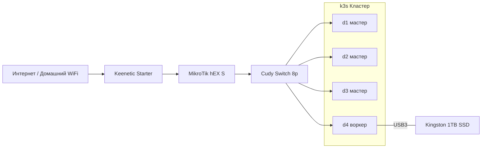

# Версия 1

> Ноябрь 2025 – настоящее время

Первая версия домашнего кластера. Четыре мини-ПК, объединённые в k3s кластер, с выделенным маршрутизатором и доступом в интернет через WiFi-мост.

## Цели и принципы

- **Бюджетный кластер** для обучения Kubernetes и self-hosting
- **Единая точка управления сетью** – все сетевые настройки сконцентрированы на MikroTik
- **Автоматизация через Ansible** – повторяемость и идемпотентность конфигурации, не делать руками по 5 раз одно и то же
- **Без кабеля через квартиру** – WiFi-мост для выхода в интернет вместо прокладки Ethernet
- **Гибкость** – рабочая нагрузка может запускаться на любой ноде, включая мастер-ноды

## Архитектура

## Подробная документация

- [Железо](hardware.md) – спецификации всех устройств, ноды d1-d4, хранилище
- [Сеть](network.md) – сетевая топология, IP-адресация, WiFi-мост
- [Софт](software.md) – ОС, k3s, Ansible, сервисы (в процессе наполнения)
