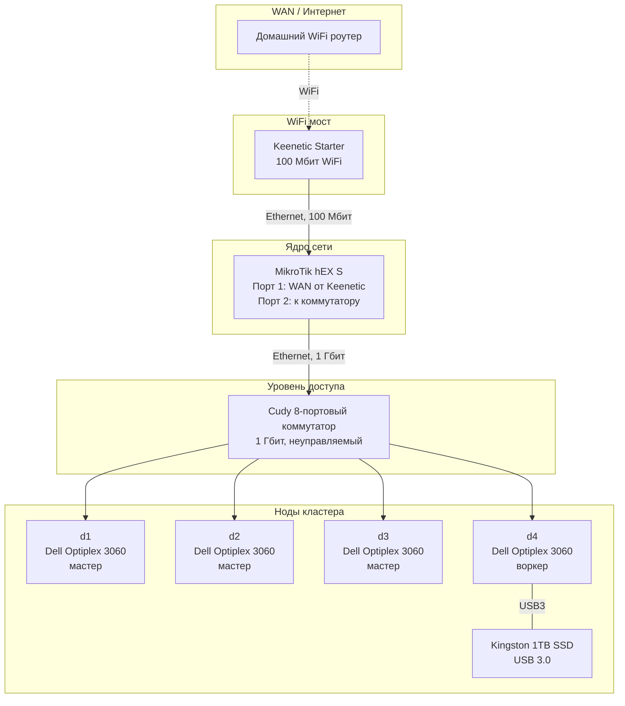

# Сеть

## Физическая топология



## Путь трафика

Как пакет идёт от ноды кластера в интернет и обратно:

```
Нода (d1-d4) → Cudy Switch → MikroTik hEX S → Keenetic Starter → WiFi → Домашний роутер → ISP
```

Обратный путь – в обратном порядке. Весь трафик между нодами проходит через коммутатор на скорости 1 Гбит. Трафик в интернет ограничен 100 Мбит (узкое место – WiFi-мост Keenetic Starter).

## Роль каждого устройства

### Keenetic Starter – WiFi-мост

Единственная задача – подключиться к домашнему WiFi и передать интернет по кабелю на MikroTik. Никаких сетевых настроек для кластера на нём нет: ни DHCP, ни firewall, ни маршрутизации. Используется исключительно как "мост" между WiFi и Ethernet.

### MikroTik hEX S – маршрутизатор

Единая точка управления всей сетью кластера:

- **DHCP** – раздаёт IP-адреса нодам (или статические назначения)
- **Маршрутизация** – управляет трафиком между кластером и интернетом
- **Firewall** – правила фильтрации трафика
- **DNS** (опционально) – если настроено

Все сетевые настройки кластера целенаправленно сосредоточены здесь, чтобы иметь одну точку конфигурации.

### Cudy Switch – коммутатор

Прозрачный неуправляемый коммутатор на 8 портов (1 Гбит). Объединяет все 4 ноды на один порт MikroTik. Выбран для удобства подключения и с запасом свободных портов на случай расширения кластера.

## Почему такая архитектура

- **WiFi-мост вместо кабеля**: не хотелось прокладывать Ethernet через всю квартиру. Дешёвый Keenetic Starter в режиме моста решил проблему за минимальную стоимость.
- **Вся логика на MikroTik**: чтобы не размазывать настройки по нескольким устройствам. Одна точка конфигурации – проще управлять и дебажить.
- **Неуправляемый коммутатор**: управляемый не нужен при текущей конфигурации. Всё управление – на MikroTik.

## Ограничения

- **100 Мбит интернет**: узкое место – WiFi-мост (Keenetic Starter 100 Мбит). Между нодами – 1 Гбит.
- **Нет VPN**: доступ к кластеру только из домашней сети по кабелю. VPN в планах.
- **Нет резервирования канала**: при отключении WiFi или Keenetic кластер теряет доступ в интернет.

<!-- ## Логическая схема сети -->
<!-- TODO: добавить описание подсетей, IP-адресов, DHCP/статика, DNS -->
