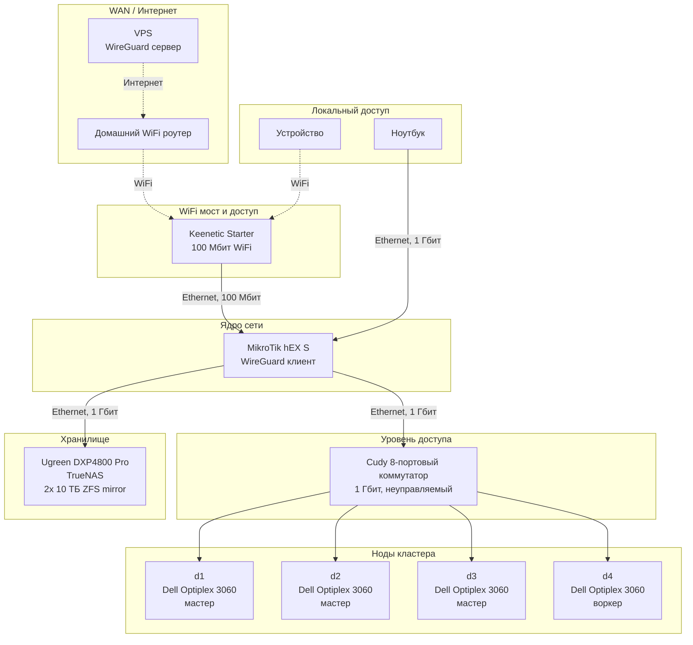

# Сеть

## Физическая топология


```mermaid
graph TD
    subgraph wan ["WAN / Интернет"]
        HomeRouter["Домашний WiFi роутер"]
        VPS["VPS\nWireGuard сервер"]
    end
    subgraph bridge ["WiFi мост и доступ"]
        Keenetic["Keenetic Starter\n100 Мбит WiFi"]
    end
    subgraph local ["Локальный доступ"]
        Laptop["Ноутбук"]
        Device["Устройство"]
    end
    subgraph core ["Ядро сети"]
        MikroTik["MikroTik hEX S\nWireGuard клиент"]
    end
    subgraph access ["Уровень доступа"]
        Switch["Cudy 8-портовый коммутатор\n1 Гбит, неуправляемый"]
    end
    subgraph storage ["Хранилище"]
        NAS["Ugreen DXP4800 Pro\nTrueNAS\n2x 10 ТБ ZFS mirror"]
    end
    subgraph nodes ["Ноды кластера"]
        D1["d1\nDell Optiplex 3060\nмастер"]
        D2["d2\nDell Optiplex 3060\nмастер"]
        D3["d3\nDell Optiplex 3060\nмастер"]
        D4["d4\nDell Optiplex 3060\nворкер"]
    end

    VPS -.->|Интернет| HomeRouter
    HomeRouter -.->|WiFi| Keenetic
    Keenetic -->|"Ethernet, 100 Мбит"| MikroTik
    Device -.->|WiFi| Keenetic
    Laptop -->|"Ethernet, 1 Гбит"| MikroTik
    MikroTik -->|"Ethernet, 1 Гбит"| Switch
    MikroTik -->|"Ethernet, 1 Гбит"| NAS
    Switch --> D1
    Switch --> D2
    Switch --> D3
    Switch --> D4
```

## Путь трафика

Как пакет идёт от ноды кластера в интернет и обратно:

```
Нода (d1-d4) → Cudy Switch → MikroTik hEX S → Keenetic Starter → WiFi → Домашний роутер → ISP
```

Обратный путь – в обратном порядке. Весь трафик между нодами проходит через коммутатор на скорости 1 Гбит. Трафик в интернет ограничен 100 Мбит (узкое место – WiFi-мост Keenetic Starter).

NAS подключён напрямую в отдельный порт MikroTik (не через коммутатор). Трафик между нодами и NAS идёт через MikroTik:

```
Нода (d1-d4) → Cudy Switch → MikroTik hEX S → Ugreen NAS
```

## Роль каждого устройства

### Keenetic Starter – WiFi-мост и WiFi-доступ

Работает в двух режимах одновременно:

- **WiFi-мост** – подключается к домашнему WiFi и передаёт интернет по кабелю на MikroTik
- **Собственная WiFi-сеть** – раздаёт отдельную сеть для доступа к публичным сервисам кластера

Сетевые настройки кластера (DHCP, firewall, маршрутизация) на Keenetic не выполняются – он используется как мост к домашнему WiFi и как точка доступа для потребления контента из кластера.

### MikroTik hEX S – маршрутизатор

Единая точка управления всей сетью кластера:

- **DHCP** – раздаёт IP-адреса нодам (или статические назначения)
- **Маршрутизация** – управляет трафиком между кластером и интернетом
- **Firewall** – правила фильтрации трафика
- **DNS** (опционально) – если настроено
- **WireGuard клиент** – поддерживает постоянный туннель до VPS (WireGuard сервер) для удалённого доступа к кластеру

Все сетевые настройки кластера целенаправленно сосредоточены здесь, чтобы иметь одну точку конфигурации.

### Cudy Switch – коммутатор

Прозрачный неуправляемый коммутатор на 8 портов (1 Гбит). Объединяет все 4 ноды на один порт MikroTik. Выбран для удобства подключения и с запасом свободных портов на случай расширения кластера.

### Ugreen DXP4800 Pro – NAS

Подключён напрямую в отдельный порт MikroTik. Используется исключительно как хранилище данных – сервисы на нём не запускаются. Доступ из кластера и с ноутбука по сети.

## Почему такая архитектура

- **WiFi-мост вместо кабеля**: не хотелось прокладывать Ethernet через всю квартиру. Дешёвый Keenetic Starter в режиме моста решил проблему за минимальную стоимость.
- **Вся логика на MikroTik**: чтобы не размазывать настройки по нескольким устройствам. Одна точка конфигурации – проще управлять и дебажить.
- **Неуправляемый коммутатор**: управляемый не нужен при текущей конфигурации. Всё управление – на MikroTik.

## Доступ к кластеру

### Локальное подключение

Ноутбук подключается кабелем напрямую в свободный порт MikroTik. Скорость соединения – 1 Гбит. Это основной способ работы с кластером: используется для повседневного управления, а также для передачи больших объёмов данных (например, на NAS).

### WireGuard VPN

Удалённый доступ к кластеру реализован через WireGuard VPN с промежуточным VPS:


```mermaid
graph LR
    Client["Удалённый клиент"] -->|WireGuard| VPS["VPS\nWireGuard сервер"]
    VPS -->|Интернет| HomeRouter["Домашний роутер"]
    HomeRouter -.->|WiFi| Keenetic["Keenetic Starter"]
    Keenetic --> MikroTik["MikroTik hEX S\nWireGuard клиент"]
    MikroTik --> Cluster["Ноды кластера"]
```

Дома нет выделенного IP-адреса – он динамический и может меняться. Поэтому арендован внешний VPS со статическим IP, на котором развёрнут WireGuard-сервер. Схема работает так:

1. На VPS запущен WireGuard-сервер – он принимает подключения и на нём заводятся пользователи
2. MikroTik настроен как WireGuard-клиент и поддерживает постоянный туннель до VPS
3. Удалённый клиент подключается к VPS, трафик маршрутизируется через туннель в домашнюю сеть

Благодаря тому, что инициатором соединения выступает MikroTik, смена домашнего IP не влияет на доступность кластера – туннель переустанавливается автоматически.

Путь трафика через VPN:

```
Удалённый клиент → VPS (WireGuard) → Интернет → Домашний роутер → WiFi → Keenetic Starter → MikroTik hEX S (WireGuard) → Cudy Switch → Нода (d1-d4)
```

VPN используется для удалённого управления кластером. Для передачи больших объёмов данных он не подходит из-за ограниченной пропускной способности – для этого используется локальное подключение по кабелю.

### WiFi-сеть Keenetic

Keenetic Starter раздаёт отдельную WiFi-сеть для доступа к публичным сервисам кластера. Доступны только адреса из конкретного диапазона, выделенного для пользовательских сервисов – это сеть для потребления контента (медиа, публичные веб-сервисы и т.п.).

Для администрирования кластера эта сеть не используется – нужен кабель к MikroTik или WireGuard VPN.

## Ограничения

- **100 Мбит интернет**: узкое место – WiFi-мост Keenetic Starter (100 Мбит). Между нодами – 1 Гбит. WiFi-доступ к сервисам также ограничен 100 Мбит.
- **Скорость VPN**: WireGuard через VPS подходит для управления, но не для передачи больших объёмов данных.
- **Нет резервирования канала**: при отключении WiFi или Keenetic кластер теряет доступ в интернет.

<!-- ## Логическая схема сети -->
<!-- TODO: добавить описание подсетей, IP-адресов, DHCP/статика, DNS -->
