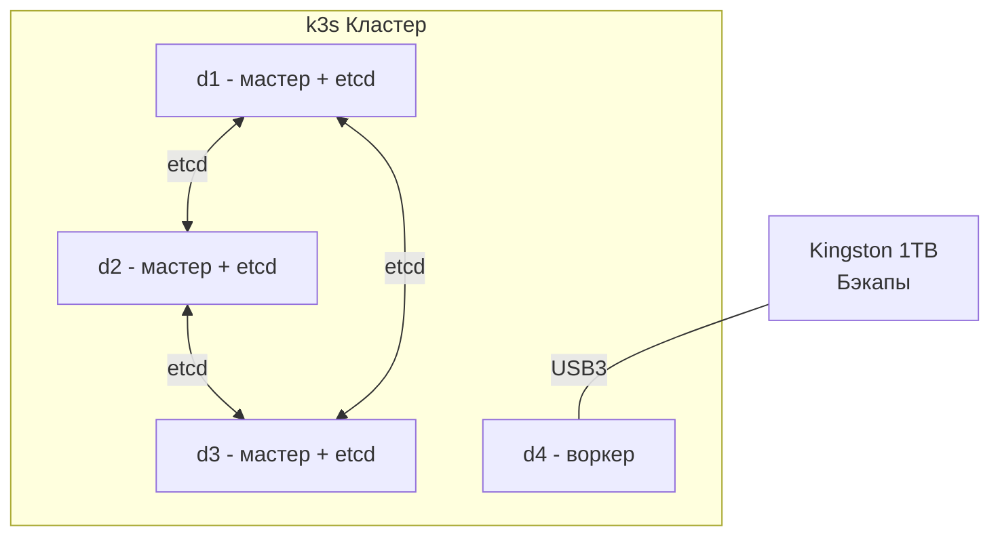

# Софт

## Операционная система

На всех нодах установлена **Ubuntu Server 22.04 LTS**.

## Управление конфигурацией

Конфигурация всех нод управляется через **Ansible** – это обеспечивает повторяемость, идемпотентность и возможность быстро воспроизвести настройки при необходимости.

k3s кластер развёрнут с помощью плейбука [k3s-ansible](https://github.com/timothystewart6/k3s-ansible) (by Techno Tim).

## Оркестрация: k3s

Лёгкий дистрибутив Kubernetes – [k3s](https://k3s.io/).

### Топология кластера

- **3 мастер-ноды** (d1, d2, d3) с встроенным etcd для HA
- **1 воркер-нода** (d4) с подключённым внешним SSD для бэкапов
- Рабочая нагрузка может запускаться на **любой ноде**, включая мастер-ноды (taints сняты)

## Сервисы и приложения

| Сервис | Назначение |
|--------|-----------|
| [CloudNativePG](https://github.com/cloudnative-pg/cloudnative-pg) | PostgreSQL-кластер: по одной реплике на каждой ноде, асинхронная репликация |
| [Forgejo](https://forgejo.org/) | Self-hosted Git-хостинг для хранения репозиториев |
| [Taiga](https://taiga.io/) | Управление задачами и проектами |
| [qBittorrent](https://www.qbittorrent.org/) | Торрент-клиент |
| [Grafana](https://grafana.com/) | Дашборды и визуализация метрик |
